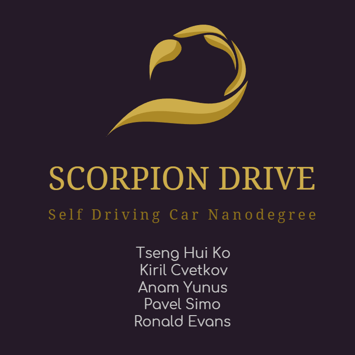
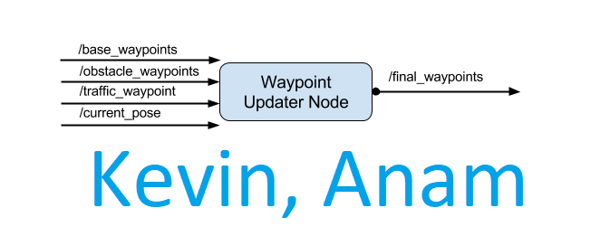
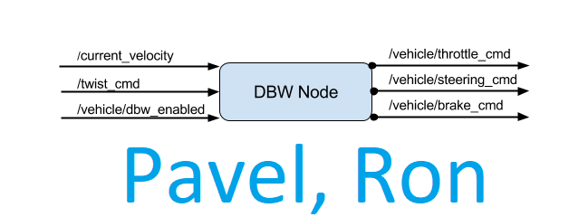
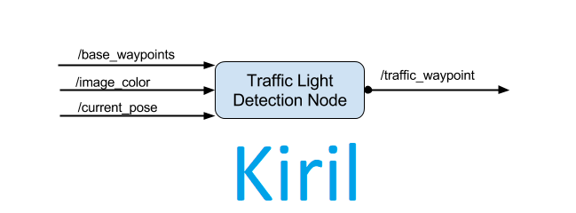

# Programming a Real Self-Driving Car

 Welcome to *Scorpion Drive's* capstone project for the Udacity Self-Driving Car Engineer Nanodegree Program: **Programming a Real Self-Driving Car**. This was the only project that gave students the opportunity to work as a team.  The *Scorpion Drive* team consisted of five members from two continents and four countries: **Canada**, the **United States** (California and Massachusetts), the **Dominican Republic** and the very small country of **North Macedonia**.

<p align="center">
   
</p>


Name | Email| GitHub | Location | Task
------------ | ------------- | ------------- | ------------- | -------------
Kiril Cvetkov (team lead) | myblueiceeyes@hotmail.com | @kirilcvetkov92 | Skopje, Macedonia| Traffic Light Detector and Waypoint Publishing
Ronald Evans | ron@cancunron.com | @rons-git | Cape Cod, MA, U.S. | DBW Node, Twist Controller
Pavel Simo | pavel.simo@gmail.com | @pavelsimo | Dominican Republic | DBW Node, Twist Controller
Anam Yunus | anam.yunus@gmail.com | @anammy | Toronto, ON, Canada | Waypoint Updater Partial/Full
Tseng Hui Ko | kevinko1788@gmail.com | @kevinko1788 | Los Angeles, CA, U.S.|  Waypoint Updater Partial/Full


## Project Specification
#### The submitted code works successfuly to navigate the car around the simulator track:
- [x] The vehicle runs safely and completes the entire course (7KM),

- [x] The vehicle accurately detects the illuminated color of all traffic lights,

- [x] The vehicle stops when traffic lights are red or yellow and proceeds when traffic lights are green.

## General ROS Architecture
<p align="center">
   
</p>


# Responsibilities 

<p align="center">
   
</p>

<p align="center">
   
</p>

<p align="center">
   
</p>

# Project Repository
The capstone's project repository is presented below. For background information on this project, see the introduction [here](https://classroom.udacity.com/nanodegrees/nd013/parts/6047fe34-d93c-4f50-8336-b70ef10cb4b2/modules/e1a23b06-329a-4684-a717-ad476f0d8dff/lessons/462c933d-9f24-42d3-8bdc-a08a5fc866e4/concepts/5ab4b122-83e6-436d-850f-9f4d26627fd9).

## Pretrained Model Weights
* [Download Simulator weights](https://www.dropbox.com/sh/c827e8nw9uxltvs/AACCUeUG5hyLNlRx6uDqu934a?dl=0) 
* Place Simulator data inside : ros/src/tl_detector/light_classification/model_data_sim/,
* [Download Real-World weights](https://www.dropbox.com/sh/4yjphz0paig3ull/AACB5z_f-l_L6DN8eU_dmxATa?dl=0)
* Place Real-World data inside : ros/src/tl_detector/light_classification/model_data_real/,


## Installations
Use **one** of the two installation options, either native **or** docker installation.
#### Native Installation

* Be sure that your workstation is running Ubuntu 16.04 Xenial Xerus or Ubuntu 14.04 Trusty Tahir. [Ubuntu downloads can be found here](https://www.ubuntu.com/download/desktop).
* If using a Virtual Machine to install Ubuntu, use the following configuration as a minimum:
  * 2 CPU
  * 2 GB system memory
  * 25 GB of free hard drive space

  The Udacity provided virtual machine has ROS and Dataspeed DBW already installed, so you can skip the next two steps if you are using this.

* Follow these instructions to install ROS
  * [ROS Kinetic](http://wiki.ros.org/kinetic/Installation/Ubuntu) if you have Ubuntu 16.04.
  * [ROS Indigo](http://wiki.ros.org/indigo/Installation/Ubuntu) if you have Ubuntu 14.04.
* [Dataspeed DBW](https://bitbucket.org/DataspeedInc/dbw_mkz_ros)
  * Use this option to install the SDK on a workstation that already has ROS installed: [One Line SDK Install (binary)](https://bitbucket.org/DataspeedInc/dbw_mkz_ros/src/81e63fcc335d7b64139d7482017d6a97b405e250/ROS_SETUP.md?fileviewer=file-view-default)
* Download the [Udacity Simulator](https://github.com/udacity/CarND-Capstone/releases).

#### Docker Installation
[Install Docker](https://docs.docker.com/engine/installation/)

Build the docker container
```bash
docker build . -t capstone
```

Run the docker file
```bash
docker run -p 4567:4567 -v $PWD:/capstone -v /tmp/log:/root/.ros/ --rm -it capstone
```

## Port Forwarding
To set up port forwarding, please refer to the [instructions from term 2](https://classroom.udacity.com/nanodegrees/nd013/parts/40f38239-66b6-46ec-ae68-03afd8a601c8/modules/0949fca6-b379-42af-a919-ee50aa304e6a/lessons/f758c44c-5e40-4e01-93b5-1a82aa4e044f/concepts/16cf4a78-4fc7-49e1-8621-3450ca938b77)

## Usage

1. Clone the project repository
```bash
git clone https://github.com/udacity/CarND-Capstone.git
```

2. Install python dependencies
```bash
cd CarND-Capstone
pip install -r requirements.txt
```
3. Make and run styx
```bash
cd ros
catkin_make
source devel/setup.sh
roslaunch launch/styx.launch
```
4. Run the simulator

## Real world testing
1. Download the  [training bag](https://s3-us-west-1.amazonaws.com/udacity-selfdrivingcar/traffic_light_bag_file.zip) that was recorded on the Udacity self-driving car.
2. Unzip the file
```bash
unzip traffic_light_bag_file.zip
```
3. Play the bag file
```bash
rosbag play -l traffic_light_bag_file/traffic_light_training.bag
```
4. Launch your project in site mode
```bash
cd CarND-Capstone/ros
roslaunch launch/site.launch
```
5. Confirm that traffic light detection works on real life images
